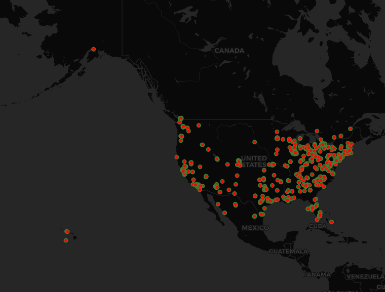

# parthwanagelab02

# Protest tweets in the United States
## Map Description
This map created on QGIS, provides the locations of people tweeting about protests in the period of 1 minute (60 seconds) using red colored dots outlined in green. The red color was chosen as these tweets can create potential danger zones and could be responsible for the spread of the Coronavirus in the United States of America.
	People in the United States have lost their patience of staying at home and are unable to comprehend the seriousness and vast impact of the coronavirus as they conduct protests to fight for their ‘Freedom’. Hence, people are taking to the streets in order to protest the lockdown forgetting the very purpose of the lockdown. These protests will lead to the additional spread of the coronavirus as groups of people are gathering together in common areas / public spaces for protesting carelessly violating the rules or recommendation of the government. The Coronavirus cannot be contained if citizens continue such activities as these gatherings could lead to the super spread of the virus by only having one infected individual present at any one of these protest sites.
	This map will be useful for the authorities and other awareness institutions for tracking the Geolocation of tweets and curbing down the demonstrations in order to contain the spread of the virus. It will also help twitter from preventing misinformation, fake news, and prevent it from being a tool of gathering masses in locations. As the map shows that most of the protest tweets are taking place on the East coast and southern states in comparison to the West coast. This suggests that people are taking the fear of coronavirus more seriously on the West Coast in comparison to the East Coast and Southern States. It is also observed that protest tweets and dissents are largely taking place in large metropolitan cities due to the lack of enough personal spaces/ presence of small homes and the larger number of facilities, entertainment, and outdoor activities motivating people to step out of their houses and making them lose patience to stay at home.
